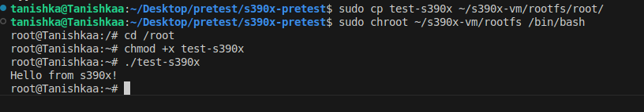

# s390x Pretest – LFX 2025 (WasmEdge)

This repository demonstrates successful setup and testing of the **s390x architecture** on an x86 Ubuntu system using QEMU and Debian's debootstrap. This pretest is part of the application process for the **WasmEdge LFX 2025 project: "Port WasmEdge and the WASI-NN ggml backend to the s390x platform."**


## Objective

The goal of this pretest is to prove that I have:

- Emulated and worked with the **s390x (IBM Z)** architecture.
- Successfully **cross-compile a binary** for s390x.
- **Executed the binary** in a chrooted s390x environment via QEMU.
- Understood the toolchain setup and testing process.


## Tools & Technologies Used

| Tool                     | Purpose                                      |
|--------------------------|----------------------------------------------|
| **QEMU**                 | Hardware emulator for running s390x binaries |
| **debootstrap**          | Bootstraps a minimal Debian filesystem       |
| **s390x-linux-gnu-gcc**  | Cross-compiler to build binaries for s390x   |
| **chroot**               | Creates isolated environment inside rootfs   |
| **Ubuntu (x86_64)**      | Host machine for development and testing     |


## Project Structure

```

s390x-pretest/
├── test.c                  # Simple "Hello from s390x" program
├── test-s390x              # Cross-compiled s390x binary
├── setup.md                # Step-by-step setup instructions
├── README.md               # This file
├── screenshots/            # Terminal screenshots for verification
│   ├── compile-output.png
│   ├── chroot-output.png
│   └── test-output.png

````


### 1. Installed Required Packages

I installed all required tools like QEMU, GCC cross-compilers, and debootstrap using:

```bash
sudo apt install -y qemu-user-static debootstrap gcc-s390x-linux-gnu g++-s390x-linux-gnu build-essential
````

These allow us to:

* Emulate s390x (`qemu-s390x-static`)
* Cross-compile (`s390x-linux-gnu-gcc`)
* Bootstrap Debian root filesystem (`debootstrap`)


### 2. Created s390x Debian Root Filesystem

I used `debootstrap` to build a minimal Debian root filesystem in `~/s390x-vm/rootfs`:

```bash
sudo debootstrap --arch=s390x --foreign stable ~/s390x-vm/rootfs http://deb.debian.org/debian
```

Then, I copied QEMU into the rootfs so it could interpret s390x binaries:

```bash
sudo cp /usr/bin/qemu-s390x-static ~/s390x-vm/rootfs/usr/bin/
```

Finally, I completed the second stage of the bootstrap:

```bash
sudo chroot ~/s390x-vm/rootfs /debootstrap/debootstrap --second-stage
```

**Why this is important:**
This creates a real, emulated s390x system using Debian that we can enter and run binaries in.

---

### 3. Wrote the Test Program

I created a simple test file `test.c`:

```c
#include <stdio.h>
int main() {
    printf("Hello from s390x!\n");
    return 0;
}
```

---

### 4. Cross-Compiled to s390x

Used the cross-compiler to build the binary:

```bash
s390x-linux-gnu-gcc test.c -o test-s390x
```

Verified with:

```bash
file test-s390x
```

Output:

```
test-s390x: ELF 64-bit MSB pie executable, IBM S/390, version 1 (SYSV), dynamically linked, interpreter /lib/ld64.so.1, BuildID[sha1]=a1bff220f4e32e4954e99da773a08db756577f74, for GNU
/Linux 3.2.0, not stripped                                                                                                                                                             
```

**Why this is important:**
Shows that I can correctly compile C programs for s390x even on an x86 system.

---

### 5. Chrooted into s390x and Ran Binary

Copied the binary into the rootfs:

```bash
sudo cp test-s390x ~/s390x-vm/rootfs/root/
```

Entered the chroot:

```bash
sudo chroot ~/s390x-vm/rootfs /bin/bash
```

Executed the binary:

```bash
cd /root
./test-s390x
```

Got output:

```
Hello from s390x!
```

**Why this is important:**
This proves that the binary runs in a real emulated s390x environment. This is the core proof that we can build and test software for s390x.

---

## Screenshots

### Compilation Output


### Chroot Environment


### Program Output



---

## Challenges Faced

* **Permission issues**: Needed `sudo` for `cp` into `/rootfs` folders.
* **QEMU errors**: Solved by ensuring the static QEMU binary was placed inside the chroot.
* **Linker errors**: Initially forgot to add a `main()` function; corrected quickly.

---

## Conclusion

This repository shows that:

* I can set up an s390x environment on x86 using debootstrap + QEMU.
* I can cross-compile and run binaries on it.
* I understand what’s required to develop and test on s390x, preparing me to port WasmEdge to this architecture.

---

